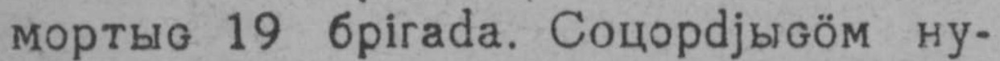
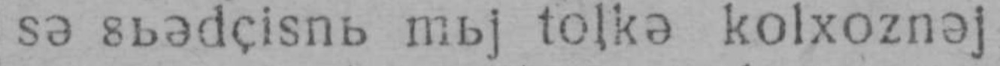
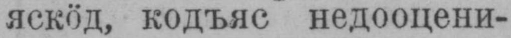

## Выль туйӧд OCR Ground Truth

This data package contains materials for training or fine-tuning OCR models to work with fonts and languages used in Выль туйӧд newspaper from 1939. One particular aspect of this data is that Zyrian Komi orthography was changed from Molodcov Komi to Cyrillic Komi in the middle of this year. 

| Year        | Orthography           | Example |
|------------ |----------------------| ---------|
|1931         |  Molodcov   |  |
|1932         |  Molodcov   |          |
|1933         |  Komi Latin   |  |
|1934         |  Molodcov   |          |
|1935         |  Molodcov   |          |
|1936         |  Molodcov   |          |
|1937         |  Molodcov   |          |
|1938         |  Molodcov   |          |
|1939         |  Molodcov       |          |
|1939         |  Komi Cyrillic       |          |

The goal is to have materials from both periods, so that OCR models could perform sufficiently well on both writing systems. This is also an experiment in OCR model fine tuning and larger adaptation|.
