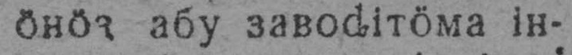

</a>

## Выль туйӧд OCR Ground Truth

This data package contains materials for training or fine-tuning OCR models to work with fonts and languages used in Выль туйӧд newspaper from 1930s, accessible in the [Fenno-Ugrica collection](https://fennougrica.kansalliskirjasto.fi) of the National Library of Finland. 

One particular aspect of this data is that Zyrian Komi orthography was changed several times between Molodcov Komi, Komi Latin and Cyrillic Komi, in 1939 in the middle of the year. 

| Year        | Orthography           | Example |
|------------ |----------------------| ---------|
|1931         |  Molodcov   |  |
|1932         |  Molodcov   |          |
|1933         |  Komi Latin   |  |
|1936         |  Molodcov   |          |
|1938         |  Molodcov   |          |
|1939         |  Molodcov       |          |
|1939         |  Komi Cyrillic       |          |

The goal is to have materials that cover all writing systems in this period, so that OCR models could perform sufficiently well on both writing systems. This is also an experiment in OCR model fine tuning and larger adaptation|.
